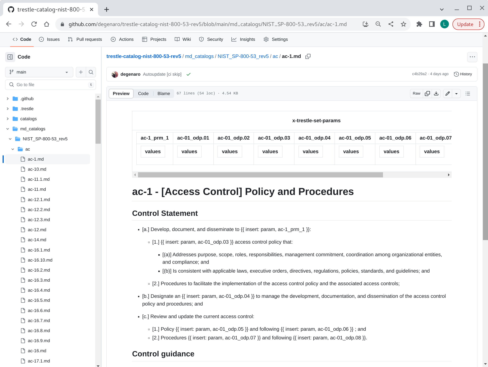
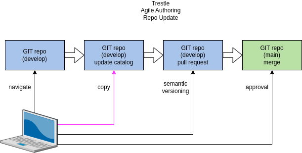
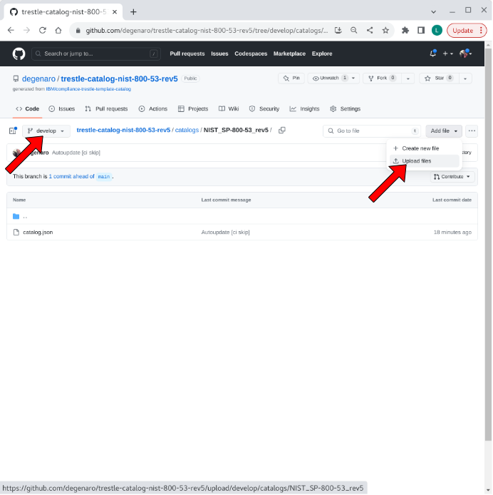
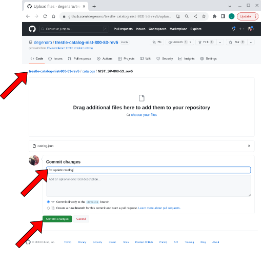
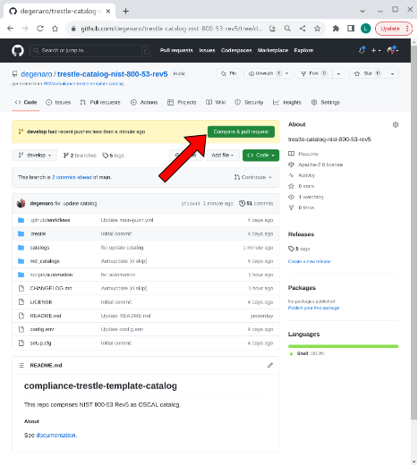
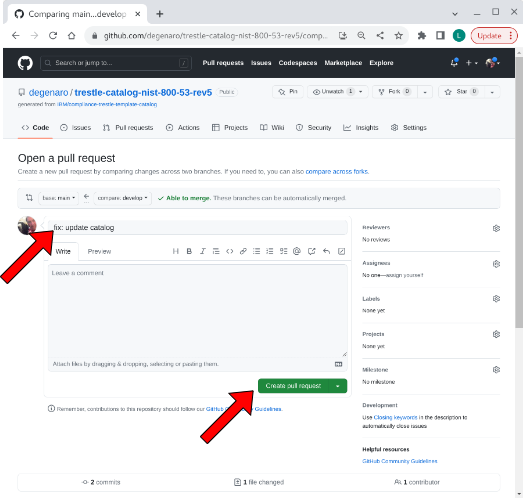
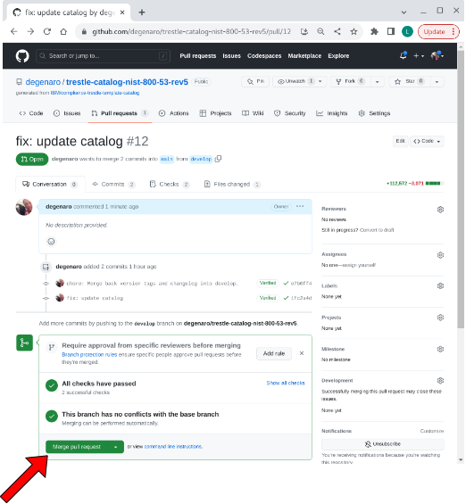

## compliance-trestle-catalog

compliance-trestle repository for agile authoring of catalog

Prerequisite: [catalog template](https://github.com/IBM/compliance-trestle-template-catalog) has been used to create catalog repo for [agile authoring](https://github.com/IBM/compliance-trestle-agile-authoring).

- [view catalog markdown](#view-catalog-markdown)
- [update catalog](#update-catalog)

-----

##### view catalog markdown

Navigate to the `md_catalogs` folder, then descend to the control of interest.

visual

-----

##### update catalog

Steps to modify the catalog repository with an updated catalog are given below:

###### 1. navigate to develop branch location of catalog in repo.

visual

###### 2. copy updated catalog to repo.

visual

###### 3. compare & pull request

visual

###### 4. create pull request

visual

###### 5. merge pull request

visual

###### 6. confirm merge

visual

-----

##### references

- [documentation: setup catalog repo](https://github.com/IBM/compliance-trestle-agile-authoring/blob/main/README.create-repo-catalog.md)

- [documentation: agile authoring](https://github.com/IBM/compliance-trestle-agile-authoring#compliance-trestle-agile-authoring)

